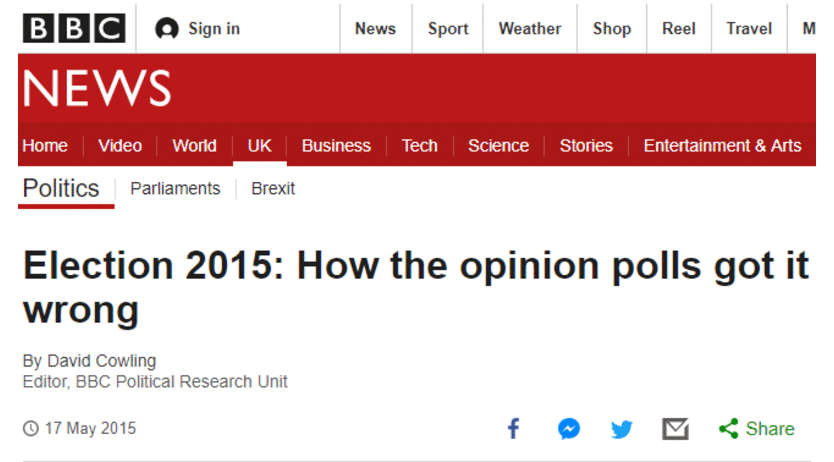
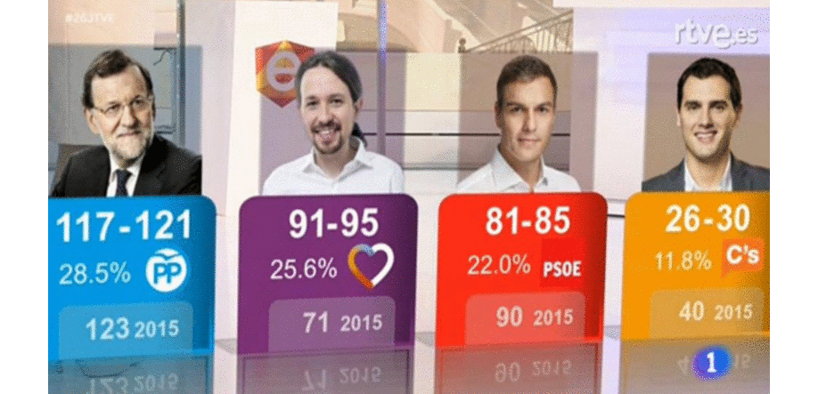
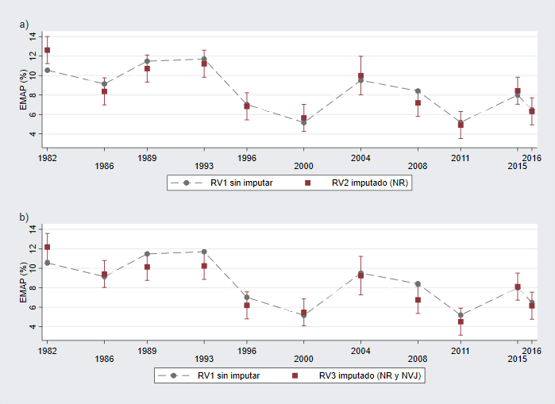
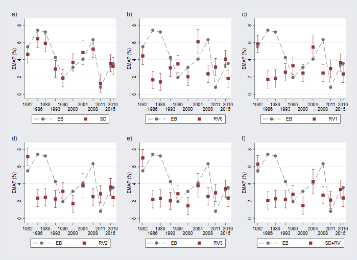
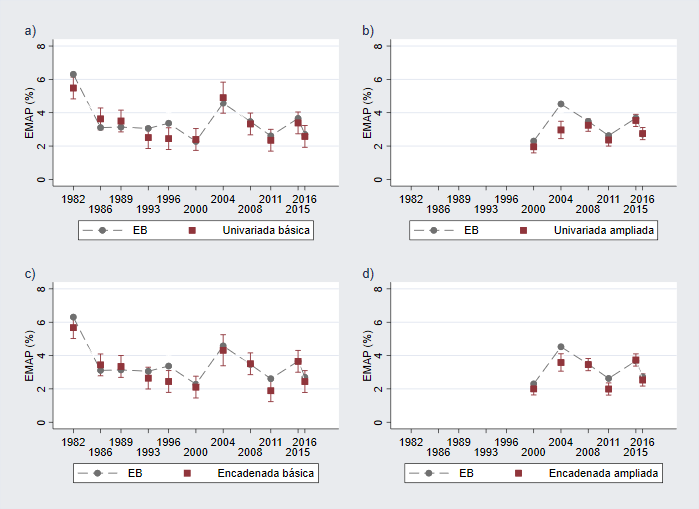

```{r xaringan-themer, include = FALSE}
library(xaringanthemer)
mono_light(base_color = "#23395b",
         title_slide_background_image = "pics/twitter.png",
         title_slide_background_size = "4%",
          title_slide_background_position = "56.5% 55%")
```

class: inverse, center, middle

# Problema

---
# Reino Unido, 2015

--


---
# España, 2016

--



---

# Y no son casos únicos...

--

.pull-left[
- Estados Unidos 1948
]

.pull-right[
- Francia 2002
]


---
# Y no son casos únicos...

.pull-left[
- Estados Unidos 1948</br>
</br> 
- Estados Unidos 1992</br>
</br>
- Virginia 1989</br>
</br>
- Reino Unido 1970</br>
</br>
- Reino Unido 1992</br>
</br>
- Reino Unido 2015</br>
</br>
- Nicaragua 1990</br>
</br>
- Hungría 2002</br>
]

.pull-right[
- Francia 2002</br>
</br>
- Francia 2007</br>
</br>
- Francia 1997</br>
</br>
- Quebec 1998</br>
</br>
- España 1993</br>
</br>
- España 1996 </br>
</br>
- España 2016 </br>
</br>
- Italia 2006
]

---

# ¿Qué puede fallar en una estimación de voto?

- Problemas de **medición**

  + Reporte erróneo deliberado (Bodor, 2012)

  + Cambio de opinión de los votantes (Durand *et al.*, 2002; MRS, 1994)

  + Modo de administración (Abramson, 2007; Callegaro y Gasperoni, 2008)
  
--

- Problemas de **representatividad**

  + Voto por correo y votantes en el extranjero

  + Estimación de la participación (Abrams, 1970; Callegaro y Gasperoni, 2008)

  + No respuesta y sesgo de autoselección (Jowell *et al.*, 1993; Durand *et al.*, 2002; Callegaro y Gasperoni, 2008; Sturgis *et al.*, 2016)
--

- Efecto **rebaño**

---

# La vida de un *pollster* en la cocina

--
.center[

]


---
class: inverse, center, middle

# Dudas

---
background-image: url(pics/pic15.png)
background-position: 50% 50% 
background-size: 95% 
# Población

--

.pull-left[
Población de cinco  </br> **hombres** y cinco **mujeres** </br> (censo)
]

--

.pull-right[
</br>
</br>
</br>
</br>
 &nbsp;&nbsp;&nbsp;&nbsp;&nbsp;&nbsp;&nbsp;&nbsp;&nbsp;&nbsp;&nbsp;&nbsp; Investigar su **intención de </br> &nbsp;&nbsp;&nbsp;&nbsp;&nbsp;&nbsp;&nbsp;&nbsp;&nbsp;&nbsp;&nbsp;&nbsp;&nbsp;voto**
]


---
background-image: url(pics/pic16.png)
background-position: 50% 50% 
background-size: 95% 
# Población

--
.pull-left[
Población (censo): </br>
</br>
 5 (50%) **Mujeres** </br>
 5 (50%) **Hombres**
]

--

.pull-right[
</br> </br></br> </br></br> </br></br> </br></br> </br></br> </br>
&nbsp;&nbsp;&nbsp;&nbsp;&nbsp;&nbsp;&nbsp;&nbsp;&nbsp;&nbsp;&nbsp;&nbsp;&nbsp;&nbsp;&nbsp;&nbsp;&nbsp;&nbsp;&nbsp;&nbsp;&nbsp;&nbsp;&nbsp;Población (modo Dios): </br> </br>
&nbsp;&nbsp;&nbsp;&nbsp;&nbsp;&nbsp;&nbsp;&nbsp;&nbsp;&nbsp;&nbsp;&nbsp;&nbsp; &nbsp;&nbsp;&nbsp;&nbsp;&nbsp;&nbsp;&nbsp;&nbsp;&nbsp;&nbsp;&nbsp;&nbsp;&nbsp;5 (50%) **Partido A**
&nbsp;&nbsp;&nbsp;&nbsp;&nbsp;&nbsp;&nbsp;&nbsp;&nbsp;&nbsp;&nbsp;&nbsp;&nbsp;&nbsp;&nbsp;&nbsp;&nbsp;&nbsp;&nbsp;&nbsp;&nbsp;&nbsp;&nbsp;&nbsp;&nbsp;&nbsp; 5 (50%) **Partido B**
]

---
background-image: url(pics/pic17.png)
background-position: 50% 50% 
background-size: 95% 
# No respuesta total

--
.pull-left[
Muestra: </br>
</br>
 2 (29%) **Mujeres** </br>
 5 (71%) **Hombres**
]

--
.pull-right[
</br> </br></br> </br></br> </br></br> </br></br> </br></br> </br>
&nbsp;&nbsp;&nbsp;&nbsp;&nbsp;&nbsp;&nbsp;&nbsp;&nbsp;&nbsp;&nbsp;&nbsp;&nbsp;&nbsp;&nbsp;&nbsp;&nbsp;&nbsp;&nbsp;&nbsp;&nbsp;&nbsp;&nbsp;Muestra: </br> </br>
&nbsp;&nbsp;&nbsp;&nbsp;&nbsp;&nbsp;&nbsp;&nbsp;&nbsp;&nbsp;&nbsp;&nbsp;&nbsp; &nbsp;&nbsp;&nbsp;&nbsp;&nbsp;&nbsp;&nbsp;&nbsp;&nbsp;&nbsp;&nbsp;&nbsp;&nbsp;2 (29%) **Partido A**
&nbsp;&nbsp;&nbsp;&nbsp;&nbsp;&nbsp;&nbsp;&nbsp;&nbsp;&nbsp;&nbsp;&nbsp;&nbsp;&nbsp;&nbsp;&nbsp;&nbsp;&nbsp;&nbsp;&nbsp;&nbsp;&nbsp;&nbsp;&nbsp;&nbsp;&nbsp; 5 (71%) **Partido B**
]


---
background-image: url(pics/pic17.png)
background-position: 50% 50% 
background-size: 95% 
# Ponderación de no respuesta

--
.pull-left[
</br> </br>
Ponderación como: </br> </br>
&nbsp;&nbsp;&nbsp;&nbsp;&nbsp;&nbsp;&nbsp;&nbsp;&nbsp;&nbsp;&nbsp;&nbsp; $w_i = \frac{N_i}{n_i}$

Para las **mujeres**: </br> </br>
&nbsp;&nbsp;&nbsp;&nbsp;&nbsp;&nbsp;&nbsp;&nbsp;&nbsp;&nbsp;&nbsp;&nbsp; $w_m = \frac{5}{2} = 2.5$

Para los **hombres**: </br> </br>
&nbsp;&nbsp;&nbsp;&nbsp;&nbsp;&nbsp;&nbsp;&nbsp;&nbsp;&nbsp;&nbsp;&nbsp; $w_h = \frac{5}{5} = 1.0$
]

--

.pull-right[
</br> </br></br> </br>
&nbsp;&nbsp;&nbsp;&nbsp;&nbsp;&nbsp;&nbsp;&nbsp;&nbsp;&nbsp;&nbsp;&nbsp;&nbsp;&nbsp;&nbsp;&nbsp;&nbsp;&nbsp;&nbsp;&nbsp;&nbsp;&nbsp;&nbsp; Estimar voto con </br> &nbsp;&nbsp;&nbsp;&nbsp;&nbsp;&nbsp;&nbsp;&nbsp;&nbsp;&nbsp;&nbsp;&nbsp;&nbsp;&nbsp;&nbsp;&nbsp;&nbsp;&nbsp;&nbsp;&nbsp;&nbsp;&nbsp;&nbsp; **ponderaciones**: 
</br> </br>

&nbsp;&nbsp;&nbsp;&nbsp;&nbsp;&nbsp;&nbsp;&nbsp;&nbsp;&nbsp;&nbsp;&nbsp;&nbsp;&nbsp;&nbsp;&nbsp;&nbsp;&nbsp;&nbsp;&nbsp;&nbsp;&nbsp;&nbsp;**M - A**: $2*2.5 = 5$ (50%)  </br>
&nbsp;&nbsp;&nbsp;&nbsp;&nbsp;&nbsp;&nbsp;&nbsp;&nbsp;&nbsp;&nbsp;&nbsp;&nbsp;&nbsp;&nbsp;&nbsp;&nbsp;&nbsp;&nbsp;&nbsp;&nbsp;&nbsp;&nbsp;**H - B**: $5*1.0 = 5$ (50%)   </br>
]

---
# Ponderación de no respuesta


  * **Ajuste estadístico** que permite compensar las diferencias en las probabilidades de respuesta de diferentes subgrupos (Särndal, 2007)

--

  * **Variables auxiliares** disponibles para los que responden y los que no responden, o al menos los totales poblacionales (*por ej.* sexo, edad, voto en anteriores elecciones...)

--

  * **Variables auxiliares**  que estén correlacionadas con la **probabilidad de responder** y la **variable de interés** (*por ej.* intención de voto)

--

* La **distribución de la variable de interés** dentro de los subgrupos de las variables auxiliares debe ser similar a la distribución en la población (Sturgis *et al.*, 2016)

--

* En estudios para estimar voto uso recurrente de la variable **recuerdo de voto**. Debate sobre su uso (Crespi, 1988; Voss *et al.*, 1995; Durand *et al.*, 2015; Crewe, 2001; Escobar *et al.*, 2014)

---
# Problemas del recuerdo de voto

```{r, echo=FALSE, warning=FALSE, message=FALSE, fig.width=11, fig.height=7}
library(tidyverse)

data <- read_csv2("data/recuerdo_voto_cis.csv")
data_re <- reshape2::melt(data = data, id.vars = c("year", "year2", "month", "elec", "bar", "periodo", "id"))
data_re <- data_re %>% filter(!is.na(value)) %>% mutate(myear = paste(month, year, sep = "-"),
                                                        varper = paste0(variable, periodo, elec))

ggplot(data_re, aes(x = reorder(myear, id), y = value, col = variable, group = varper )) +
  geom_line(size = .75) +
  geom_point(data = filter(data_re, elec ==1), size = 3, shape = 15) +
  labs(title = "Recuerdo de voto barómetros CIS (1994-2004)",
       subtitle = "En porcentaje sobre censo") +
  scale_color_manual(values = c("darkorange", "darkorchid4", "grey", "maroon", "red2", "deepskyblue2"),
                     labels = c("NS", "NC", "Blanco", "No votó", "PSOE", "PP")) +
  theme(axis.text.x = element_text(angle = 90, hjust = 1),
        axis.title = element_blank(),
        axis.ticks = element_blank(),
        panel.grid.major.x = element_blank(),
        panel.grid.minor.x = element_blank(),
        panel.grid.major.y = element_line(color = "gray70"),
        panel.grid.minor.y = element_blank(),
        panel.background = element_rect(fill = "#E9EBEE"),
        plot.background = element_rect(fill = "#E9EBEE"),
        strip.background = element_rect(fill = "grey20"),
        legend.title = element_blank(),
        legend.background = element_rect(fill = "#E9EBEE"),
        strip.text = element_text(family = "Arial", color = "black", hjust = .2, face = "bold"),
        plot.caption = element_text(color = "grey40", size = 7),
        plot.subtitle = element_text(color = "grey40"))
```


---
background-image: url(pics/pic18.png)
background-position: 50% 50% 
background-size: 95% 
# No respuesta parcial

--

.pull-left[
Dos entrevistados </br>
rechazaron revelar </br>
su **intención de voto**
</br>
]

--
</br> </br></br> </br></br> </br></br> </br></br> </br></br> </br>
.pull-right[
&nbsp;&nbsp;&nbsp;&nbsp;&nbsp;&nbsp;&nbsp;&nbsp;&nbsp;&nbsp;&nbsp;&nbsp;&nbsp;&nbsp;&nbsp;&nbsp;&nbsp;&nbsp;&nbsp;&nbsp;&nbsp;&nbsp;&nbsp;&nbsp;Usar otra información </br>
&nbsp;&nbsp;&nbsp;&nbsp;&nbsp;&nbsp;&nbsp;&nbsp;&nbsp;&nbsp;&nbsp;&nbsp;&nbsp;&nbsp;&nbsp;&nbsp;&nbsp;&nbsp;&nbsp;&nbsp;&nbsp;&nbsp;&nbsp;&nbsp;de la encuesta para </br>
&nbsp;&nbsp;&nbsp;&nbsp;&nbsp;&nbsp;&nbsp;&nbsp;&nbsp;&nbsp;&nbsp;&nbsp;&nbsp;&nbsp;&nbsp;&nbsp;&nbsp;&nbsp;&nbsp;&nbsp;&nbsp;&nbsp;&nbsp;&nbsp; **imputar**
</br>
]

---

# No respuesta parcial


```{r, echo=FALSE, warning=FALSE, message=FALSE, fig.width=9, fig.height=6}
library(tidyverse)

data <- read_csv2("data/perdidos_iv_rv_cis.csv")

ggplot(data, aes(x = year, y = val, col = var, group = var )) +
  geom_line(size = 1) +
  labs(title = "Valores perdidos en preelectorales CIS",
       subtitle = "En porcentaje sobre total de casos") +
  scale_color_manual(values = c("darkorange", "darkorchid4"),
                     labels = c("Intención de voto", "Recuerdo de voto")) +
  scale_x_continuous(breaks = c(1986, 1989, 1993, 1996, 2000, 2004, 2008, 2011, 2015, 2016)) +
  scale_y_continuous(limits = c(0, 50)) +
  theme(axis.text.x = element_text(angle = 90, hjust = 1),
        axis.title = element_blank(),
        axis.ticks = element_blank(),
        panel.grid.major.x = element_blank(),
        panel.grid.minor.x = element_blank(),
        panel.grid.major.y = element_line(color = "gray70"),
        panel.grid.minor.y = element_blank(),
        panel.background = element_rect(fill = "#E9EBEE"),
        plot.background = element_rect(fill = "#E9EBEE"),
        strip.background = element_rect(fill = "grey20"),
        legend.position = "bottom",
        legend.title = element_blank(),
        legend.background = element_rect(fill = "#E9EBEE"),
        strip.text = element_text(family = "Arial", color = "black", hjust = .2, face = "bold"),
        plot.caption = element_text(color = "grey40", size = 7),
        plot.subtitle = element_text(color = "grey40"))
```

---
# Imputación

* Diversidad de **métodos de imputación**: imputación de la media/moda, *hot-deck*, imputación condicional, imputación múltiple

--

* Posibilidad de utilizar otras variables del cuestionario para **informar la imputación** (*por ej.* imputación condicional, *hot-deck*)

--

* La **imputación múltiple** consiste en generar $m$ bases de datos completas con lo que se añade a la varianza un componente derivado de la incertidumbre debida a los datos perdidos (Rivero, 2011)

--

* La imputación de la **intención de voto** llevada a cabo con técnicas *ad hoc* según la casa de encuestas (Crespi, 1988; Sturgis *et al.*, 2016)

--

* Algunos intentos de utilizar imputación múltiple en el ámbito electoral desde la academia (*por ej.*  Bernhagen y Marsh, 2007; Escobar y Jaime, 2013; Liu, 2014)

---


# Hipótesis

--

* **H1**:  La **ponderación** de la muestra por **recuerdo de voto** contribuye a incrementar la precisión de la estimación de voto

--


* **H2**: El uso de la **ponderación** que combina las variables **sociodemográficas** y el **recuerdo de voto** será el más efectivo para reducir el nivel de error de la estimación de voto 

--

* **H3**:  El uso de técnicas de **imputación múltiple** para tratar la variable **recuerdo de voto** reduce el nivel de sesgo presente en esta variable y, en consecuencia, su uso en la ponderación incrementa la precisión de la estimación de voto

--

* **H4**:  El uso de técnicas de **imputación múltiple** para asignar una **intención de voto** a aquellos que no saben o no contestan incrementa la precisión de la estimación de voto

--

* **H5**: El uso de la variable **recuerdo de voto** para ponderar tiene un efecto positivo en la precisión de las estimaciones en las **elecciones en las que hay continuidad política**, también después de 2015

---
# Datos y métodos

* **Datos** de encuestas **preelectorales y postelectorales del CIS** para las elecciones 1982-2016

--

* **Ponderaciones** generadas usando **calibración logística**


* **Imputación múltiple** utilizando un sistema  **ecuaciones encadenadas** y **univariada**

--

* Estimaciones evaluadas utilizando el **error medio absoluto ponderado** (EMAP) con respecto a los resultados electorales:

$$ EMAP =  \sum_{k=1}^{k} |\hat{p}_k - p_k|p_k $$
&nbsp;&nbsp;&nbsp;&nbsp;&nbsp;&nbsp;&nbsp;&nbsp;&nbsp;&nbsp; donde $\hat{p}_k$ es la estimación de voto para el partido $k$ y $p_k$ su resultado en </br>
&nbsp;&nbsp;&nbsp;&nbsp;&nbsp;&nbsp;&nbsp;&nbsp;&nbsp;&nbsp;&nbsp;las elecciones

* EMAP de cada estimación y recuerdo de voto imputado modelado usando regresión lineal (MCO) 

---
# Métodos: ponderación

|    Nombre    |    Variables de ponderación                  |    RV imputado    |    Ámbito del RV               |
|-------------|----------------------------------------------|-------------------|-----------------------------------|
|    **EB**       |    Provincia                                 |                   |                                   |
|    **SD**       |    Provincia y sociodemográficas (SD)        |                   |                                   |
|    **RV0**      |    Provincia y recuerdo de voto (RV)        |    No             |    NR, NV y NVJ excluidos    |
|    **RV1**      |    Provincia y RV             |    No             |    NR, NV y NVJ incluidos     |
|    **RV2**      |    Provincia y RV             |    Sí (NR imputado)            |    NR, NV y NVJ incluidos      |
|    **RV3**      |    Provincia y RV             |    Sí (NR y NVJ imputado)             |    NR, NV y NVJ incluidos     |
|    **SD+RV**    |    Provincia, SD y RV    |    Sí (NR y NVJ imputado)             |    NR, NV y NVJ incluidos     |

---
# Métodos: imputación múltiple


* **Recuerdo de voto**: 

|    Nombre                  |    Variable objetivo   (modelo)      |    Predictores    |
|-------------------------------|--------------------------------------|-------------------------------|
|    RV1 sin imputar            |                                      |                               |
|    RV2 imputado (NR)          |    Recuerdo de voto (multinomial)    |    Conjunto mixto             |
|    RV3 imputado (NR y NVJ)    |    Recuerdo de voto (multinomial)    |    Conjunto mixto             |

**Conjunto mixto**: Sexo, edad, tamaño de hábitat, comunidad autónoma, intención de voto e ideología

---
# Métodos: imputación múltiple

* **Intención de voto**: 

|    Nombre                      |    Variable objetivo   (modelo)                                                              |    Predictores     |
|--------------------------------|----------------------------------------------------------------------------------------------|--------------------------------|
|    No imputada              |                                                                                              |                                |
|    Univariada básica        |    Intención de voto (multinomial)                                                           |    Conjunto básico        |
|    Univariada   ampliada    |    Intención de voto (multinomial)                                                           |    Conjunto ampliado   |
|    Encadenada básica        |    Intención de voto (multinomial)   Recuerdo de voto (multinomial)   Ideología (ordinal)    |    Conjunto básico        |
|    Encadenada   ampliada    |    Intención de voto (multinomial)   Recuerdo de voto (multinomial)   Ideología (ordinal)    |    Conjunto ampliado    |

**Conjunto básico**: Sexo, edad, nivel educativo, recuerdo de voto e ideología
**Conjunto ampliado**: Sexo, edad, nivel educativo, recuerdo de voto, ideología, evaluación de la situación económica y evaluación de la situación política
---
class: inverse, middle, center

# Indicios

---

# ¿Imputar el recuerdo de voto?

.center[

]

---

# ¿Ponderar por el recuerdo de voto?

.center[

]


---
# ¿Imputar la intención de voto?

.center[

]

---
class: center, middle, inverse

# Final

---

# Conclusiones

--
</br>

* Uso de la ponderación por recuerdo de voto (**H1**) mejora la precisión de las estimaciones aunque añadir las variables sociodemográficas (**H2**) no aporta un incremento en la precisión  

--

* Usar la imputación múltiple para corregir la variable recuerdo de voto (**H3**) no repercute en el nivel de ajuste de la propia variable y tampoco en la precisión de la estimación

--

* El uso de la imputación múltiple para tratar los casos perdidos de la variable de intención de voto (**H4**) apenas afecta a la precisión de las estimaciones

--

* El momento del ciclo político, según se trate de elecciones de continuidad o de cambio (**H5**), sigue estando relacionado con la capacidad de la ponderación de mejorar la estimación de voto tras los cambios en el sistema de partidos

---
class: inverse, middle, center

## Gracias

#### pablocal@usal.es | @pablocalv </br>

</br>
</br>

Cabrera-Álvarez, Pablo y Escobar, Modesto (2019). «El efecto de la ponderación y la imputación en
el sesgo de los estudios electorales en España». Revista Española de Investigaciones Sociológicas,
165: 45-64. 

</br>
</br>
</br>

Esta investigación cuenta con el apoyo del programa de becas de la Fundación "La Caixa" LCF/BQ/ES16/11570005


